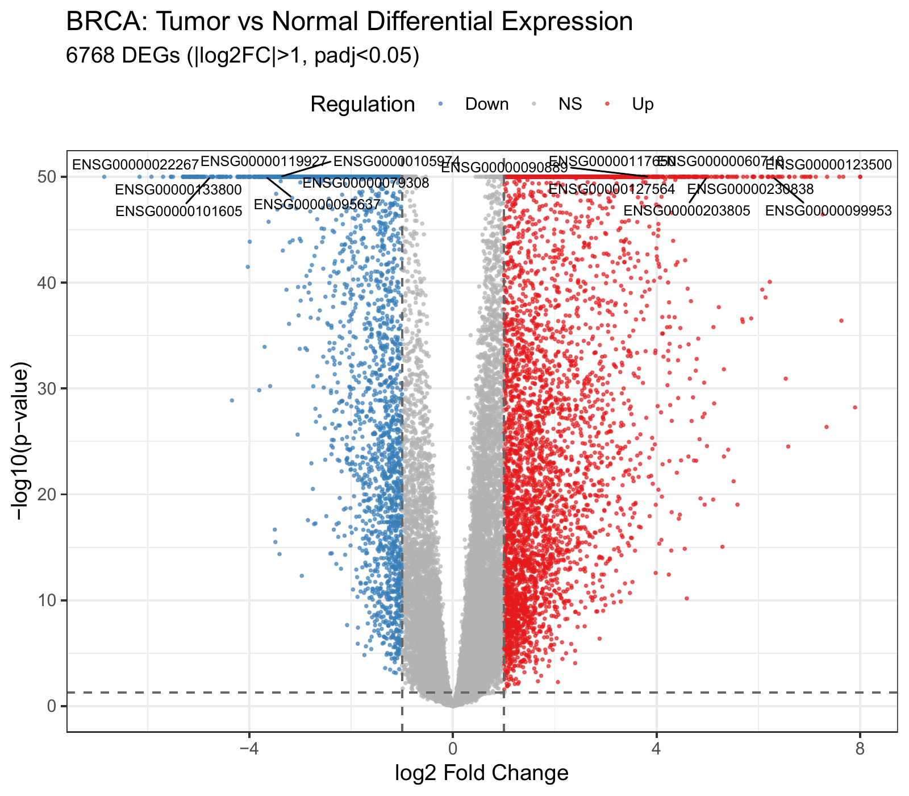
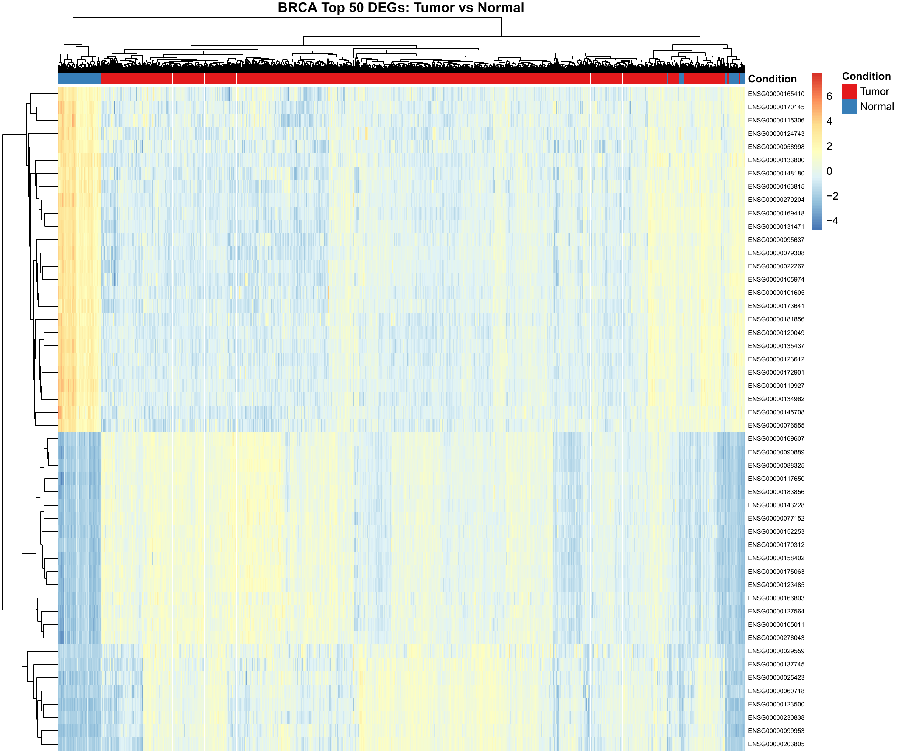
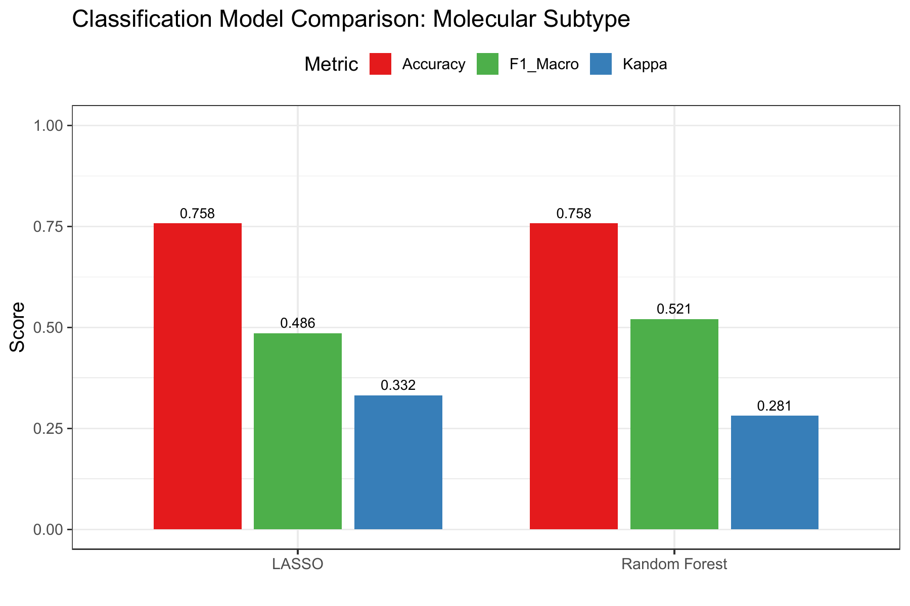
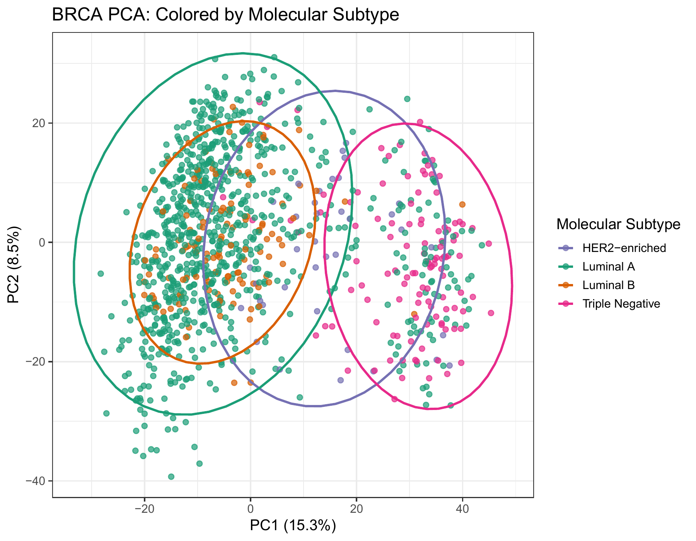
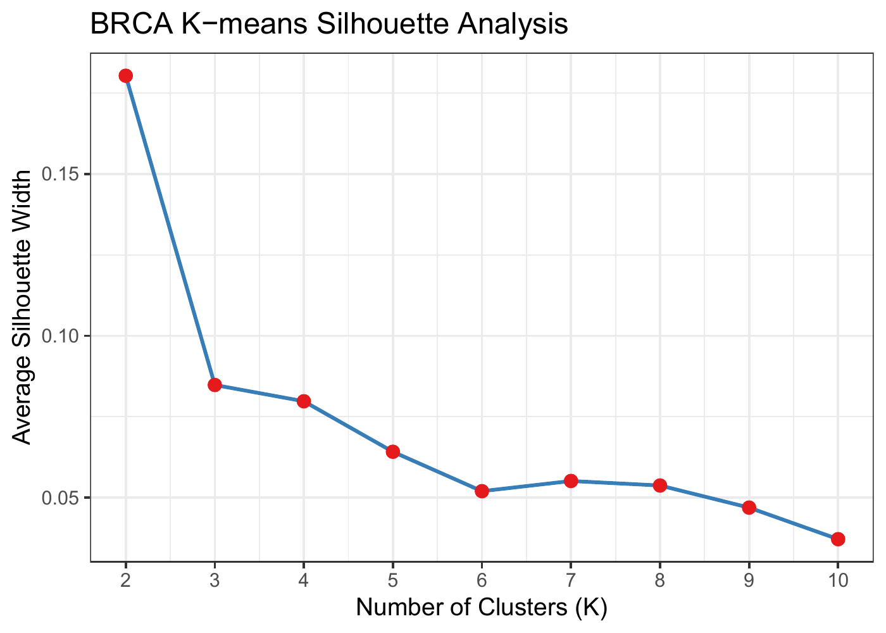
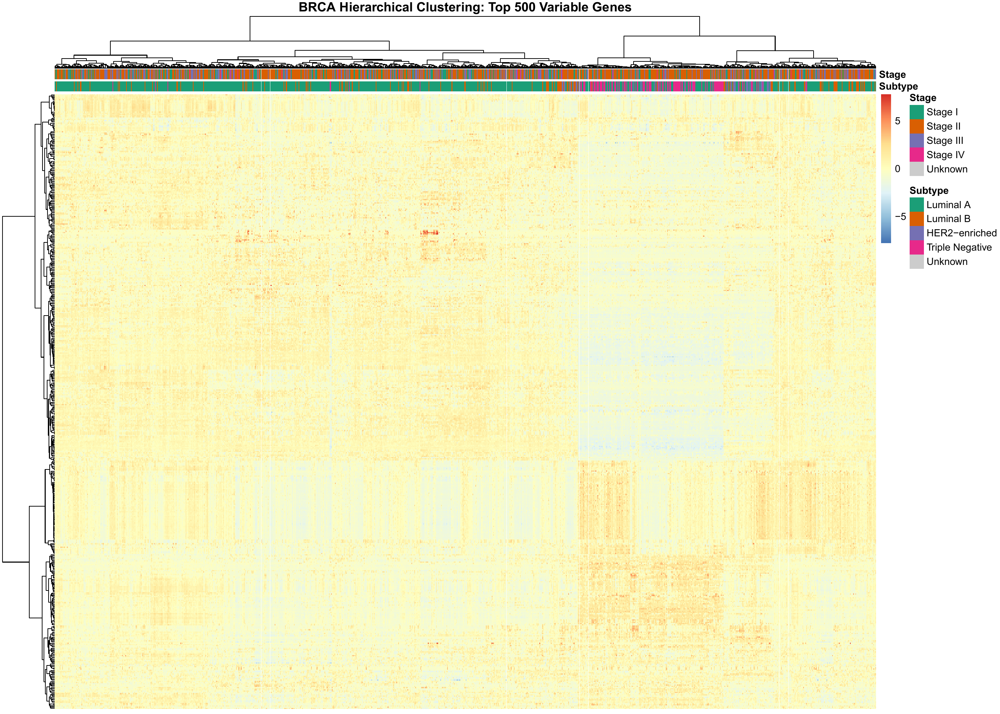
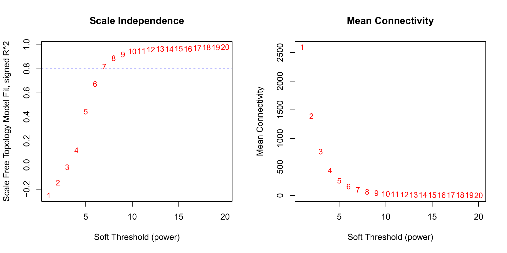
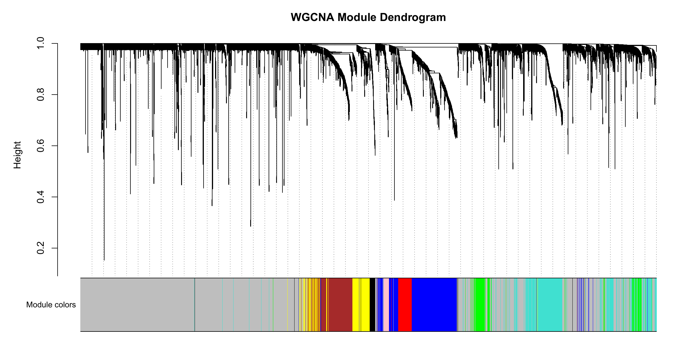
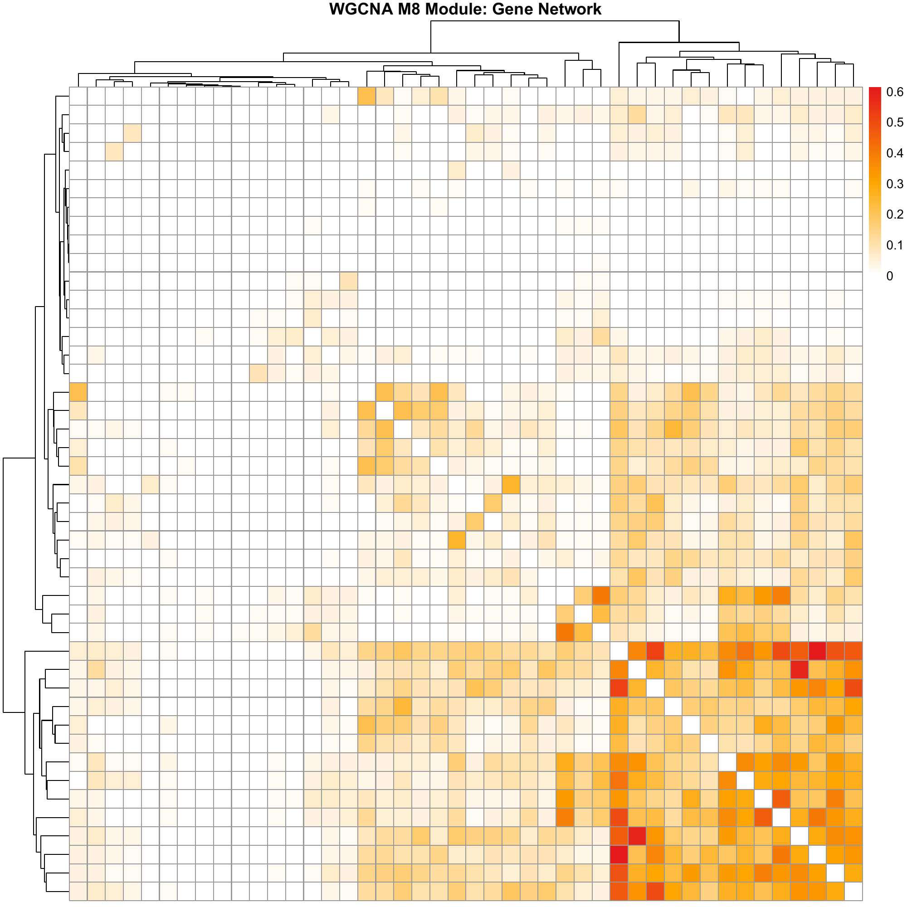

# 基于TCGA多组学数据挖掘的乳腺癌分子特征综合分析

---

## 摘要

乳腺癌是全球发病率最高的恶性肿瘤之一，其高度的分子异质性为精准诊疗带来了巨大挑战。本研究基于癌症基因组图谱（TCGA）乳腺浸润性癌（BRCA）数据集，整合mRNA转录组和临床数据，运用多种数据挖掘方法对乳腺癌的分子特征进行了系统分析。数据预处理阶段完成了TCGA样本条形码解析、肿瘤/正常样本分离、低表达基因过滤、基因标识符映射、TPM标准化以及临床数据清洗与缺失值处理。在数据挖掘阶段，本研究综合运用了以下方法：（1）DESeq2差异表达分析鉴定肿瘤与正常组织间的差异表达基因并进行功能富集分析；（2）基于Random Forest、LASSO多分类回归的分子亚型分类模型构建；（3）PCA、t-SNE、层次聚类、K-means等无监督聚类方法；（4）WGCNA加权基因共表达网络分析；（5）Kaplan-Meier生存曲线和Cox比例风险回归的预后分析。

**关键词**：乳腺癌；TCGA；数据挖掘；差异表达分析；WGCNA；机器学习分类；生存分析；R语言

---

## 1 引言

### 1.1 研究背景

据国际癌症研究机构（IARC）GLOBOCAN 2022统计，全球每年新发癌症约2,000万例，死亡约970万例。女性乳腺癌以约230万例新发病例居全球恶性肿瘤发病率首位，同年导致约67万例死亡[1]。在中国，乳腺癌发病率和死亡率持续上升，且发病年龄显著低于欧美国家，构成重大的公共卫生负担。

乳腺癌的发生发展涉及多基因突变累积、表观遗传重塑及信号通路交互失调等复杂分子过程[2]。高通量测序技术的普及使大规模癌症基因组数据的积累成为可能。以癌症基因组图谱（The Cancer Genome Atlas, TCGA）为代表的国际合作项目，为研究者提供了涵盖基因组、转录组、表观基因组及蛋白质组的海量公开数据资源[3]，使得基于数据挖掘的系统生物学研究范式得以实践。

### 1.2 乳腺癌分子分型

乳腺癌是由多种分子特征各异的亚型构成的异质性疾病集合。Perou等[4]于2000年首次基于基因表达谱提出分子分型体系。当前国际广泛认可的固有分子亚型包括：（1）Luminal A型（约占50%-60%），特征为ER阳性、HER2阴性；（2）Luminal B型（约占15%-20%）；（3）HER2过表达型（约占10%-15%）；（4）三阴性/Basal-like型（约占15%-20%），侵袭性最强。

### 1.3 数据挖掘方法概述

本研究应用的数据挖掘方法包括：DESeq2差异表达分析[5]、g:Profiler功能富集分析[8]、Random Forest[14]、LASSO多分类回归[13,17]、PCA与t-SNE降维、K-means聚类、WGCNA共表达网络[6]、Kaplan-Meier生存分析和Cox比例风险回归[16]。

---

## 2 材料与方法

### 2.1 数据来源

本研究数据来自TCGA-BRCA项目。TCGA由美国NCI和NHGRI于2006年联合启动，覆盖33种癌症类型[3]。本研究使用Level 3处理级别的mRNA转录组数据（HiSeq RNA-seq, STAR-Counts流程）和临床注释数据。

TCGA样本条形码采用标准化分层命名规则，前12个字符为患者级唯一标识符，样本类型代码（第14-15位）中01表示原发实体瘤，11表示癌旁正常组织。

### 2.2 数据预处理流程

数据预处理包括以下关键步骤：

**（1）TCGA条形码解析与样本分类**：通过提取样本条形码第14-15位的样本类型代码，将全部样本分类为肿瘤（Tumor, code=01）、正常组织（Normal, code=11）和其他类型。

**（2）低表达基因过滤**：原始表达矩阵包含60,660个基因。采用独立过滤策略，保留至少在10%肿瘤样本中counts≥10的基因，过滤后保留25,981个基因（42.8%）。

**（3）基因标识符映射**：将Ensembl Gene ID映射为标准Gene Symbol，优先使用org.Hs.eg.db注释包。

**（4）TPM标准化**：采用Transcripts Per Million（TPM）进行归一化。

**（5）临床数据清洗**：从原始94个临床变量中提取核心变量，涵盖基本信息、病理特征、分子分型和生存信息。分子亚型按ER/PR/HER2免疫组化状态分类。

**（6）缺失值处理**：数值型变量采用中位数填补，分类型变量采用众数填补。

**（7）数据对齐**：以TCGA患者ID为锚点，将表达矩阵与临床数据进行患者级对齐，最终匹配1,105例患者。

### 2.3 数据概览

TCGA-BRCA数据集包含1,106例肿瘤样本和113例正常组织样本。分子亚型分布：Luminal A 827例、Luminal B 126例、HER2-enriched 37例、Triple Negative 115例。病理分期分布：Stage I 183例、Stage II 651例、Stage III 251例、Stage IV 20例。生存信息：死亡事件87例，存活1,018例。

**图1 TCGA-BRCA数据集样本分布与病理分期分布**

---

## 3 结果与分析

### 3.1 差异表达分析

#### 3.1.1 方法

采用DESeq2[5]进行肿瘤组织（n=1,105）与正常组织（n=113）的差异表达分析。DESeq2基于负二项分布对RNA-seq计数数据建模，通过经验贝叶斯收缩改进离散度估计的稳定性，使用Wald检验评估组间差异的显著性。分析参数：显著性阈值取FDR<0.05（Benjamini-Hochberg校正）且|log2FC|>1。

#### 3.1.2 结果

差异表达分析共鉴定6,768个显著差异表达基因（|log2FC|>1, padj<0.05），其中上调4,334个、下调2,434个。上调基因数量约为下调的1.78倍，提示肿瘤组织中转录激活事件多于转录抑制事件，与肿瘤细胞的增殖活跃和代谢重编程特征一致。

**图2 BRCA差异表达火山图。红色表示上调基因，蓝色表示下调基因，灰色表示不显著基因。**

**图3 Top 50差异表达基因热图。Z-score标准化后的表达水平，展示肿瘤与正常组织之间的明显表达差异。**

#### 3.1.3 功能富集分析

采用g:Profiler[8]对上调和下调基因分别进行功能富集分析。上调基因显著富集于细胞周期、DNA复制等与细胞增殖密切相关的通路；下调基因富集于细胞外基质组织、细胞黏附等与微环境交互相关的通路。上调与下调基因的功能差异反映了肿瘤细胞增殖激活与微环境交互减弱的双重特征。

### 3.2 分子亚型分类

#### 3.2.1 方法

比较两种监督学习算法的分类性能：
- **Random Forest**：基于bagging集成，ntree=500[14]；
- **LASSO多分类回归**：通过L1正则化同时实现特征选择和模型拟合，family="multinomial", alpha=1, 5折交叉验证[13]。

输入特征为Top 500可变基因的log2(TPM+1)表达矩阵。训练集与测试集按7:3分层划分。分类目标为分子亚型（Luminal A, Luminal B, HER2-enriched, Triple Negative）。

#### 3.2.2 结果

Random Forest和LASSO均达到75.8%的分类准确率。LASSO的Kappa系数为0.332，高于Random Forest的0.281。LASSO通过L1正则化将500个候选基因压缩至少数特征基因，验证了乳腺癌分子亚型之间转录组差异的稀疏性。

**图4 分类模型性能比较（Accuracy、Kappa、Macro F1）**

**图5 Random Forest多类别ROC曲线（One-vs-All）**

**图6 Random Forest与LASSO混淆矩阵热图**

### 3.3 聚类分析

#### 3.3.1 方法

综合运用PCA、t-SNE、层次聚类和K-means轮廓分析。PCA基于Top 2000可变基因进行主成分分析；t-SNE采用perplexity=30进行非线性降维；层次聚类采用Ward.D2方法和Pearson相关系数距离；K-means对K=2至10评估轮廓系数。

#### 3.3.2 结果

PCA分析显示PC1解释了15.3%的方差，PC2解释了8.5%。按分子亚型着色的PCA图显示不同亚型在主成分空间中形成可区分的聚类，ER+与ER-亚型之间分离明显。

**图7 PCA散点图（按分子亚型着色），PC1=15.3%, PC2=8.5%**

**图8 t-SNE降维图，展示样本间的非线性结构关系**

K-means轮廓系数分析表明K=2时达到最大轮廓宽度（0.180），此后单调下降，支持ER+/ER-二分是BRCA转录组数据中最强的自然分组结构。

**图9 K-means轮廓系数分析，K=2为最优聚类数**

**图10 Top 500可变基因层次聚类热图（Ward.D2方法）**

### 3.4 WGCNA共表达网络分析

#### 3.4.1 方法

WGCNA[6]使用Top 5000可变基因构建无标度共表达网络。分析流程包括：软阈值选择（scale-free R²>0.8）、拓扑重叠矩阵构建、动态树切割模块识别（minModuleSize=30, mergeCutHeight=0.25）、模块-性状关联分析和枢纽基因识别。

#### 3.4.2 结果

软阈值选择分析确定power=8时网络满足无标度拓扑假设。经动态树切割后共识别9个共表达模块。模块-性状关联分析显示不同模块与分子亚型、病理分期和生存状态之间存在显著相关性。

**图11 WGCNA软阈值选择（左：scale-free R²；右：平均连接度），选定power=8**

**图12 WGCNA模块树状图与颜色标识（共9个模块）**

**图13 WGCNA模块-性状相关性热图，数值为Pearson相关系数**

在关键模块中识别了枢纽基因。Module M2（blue, 553个基因）的枢纽基因（ENSG00000167208）模块隶属度达0.959；Module M8（pink, 44个基因）枢纽基因MM=0.966；Module M3（brown, 336个基因）枢纽基因MM=0.940。

**图14 WGCNA关键模块基因共表达网络热图（Top 50枢纽基因）**

### 3.5 生存分析

#### 3.5.1 方法

采用Kaplan-Meier生存曲线（log-rank检验）和Cox比例风险回归[16]评估临床及分子特征的预后价值。Cox模型纳入变量包括年龄、淋巴结阳性数、病理分期和分子亚型。此外，采用LASSO-Cox方法构建预后基因标记。

#### 3.5.2 结果

Kaplan-Meier分析显示病理分期与总生存之间存在显著关联，高分期患者预后明显较差。

**图15 Kaplan-Meier生存曲线（按病理分期分组），附log-rank p值和风险表**

**图16 Kaplan-Meier生存曲线（按分子亚型分组）**

多变量Cox回归（C-index=0.767, 似然比p=3.61×10⁻¹²）结果表明：年龄（HR=1.04, p=7.38×10⁻⁶）、Stage II（HR=3.24, p=0.013）、Stage III（HR=6.00, p=2.35×10⁻⁴）和Stage IV（HR=29.82, p=7.02×10⁻¹⁰）为显著的独立预后因素。Triple Negative亚型也显示出显著的预后风险（HR=2.00, p=0.028）。

**图17 多变量Cox比例风险回归森林图，展示各变量的风险比及95%置信区间**

LASSO-Cox预后基因标记筛选出3个预后相关基因，按中位风险得分将患者分为高风险组和低风险组。

**图18 LASSO-Cox预后基因标记风险分组KM曲线**

---

## 4 可视化分析汇总

可视化在数据挖掘成果向生物学知识转化中扮演着关键角色。本研究生成的主要图表汇总如下：

| 图号 | 内容 | 分析方法 |
|-----|------|---------|
| 图1 | 样本分布与分期 | 条形图 |
| 图2 | 火山图（差异表达） | DESeq2 + ggplot2 |
| 图3 | Top DEGs热图 | DESeq2 + pheatmap |
| 图4-6 | 分类模型比较/ROC/混淆矩阵 | RF + LASSO + caret |
| 图7-10 | PCA/t-SNE/轮廓系数/层次聚类 | 无监督聚类 |
| 图11-14 | WGCNA网络分析 | WGCNA |
| 图15-18 | 生存分析 | KM + Cox + LASSO-Cox |

---

## 5 结论与展望

### 5.1 主要发现

（1）DESeq2差异表达分析鉴定6,768个显著差异基因，上调（4,334个）数量约为下调（2,434个）的1.78倍。

（2）Random Forest和LASSO分类器均达到75.8%的分类准确率，LASSO通过L1正则化实现了特征稀疏压缩。

（3）PCA（PC1=15.3%, PC2=8.5%）和K-means轮廓系数（K=2最佳，silhouette=0.180）一致表明ER状态是BRCA转录组结构的最强驱动因素。

（4）WGCNA识别9个共表达模块，枢纽基因模块隶属度最高达0.966。

（5）Cox多变量回归（C-index=0.767）证实病理分期是BRCA预后最强预测因子（Stage IV HR=29.82, p=7.02×10⁻¹⁰）。

### 5.2 研究局限性

- 仅使用mRNA转录组数据，未纳入miRNA、DNA甲基化等其他组学层次；
- 生存事件率有限（7.9%），可能影响多变量预后模型的统计功效；
- 分类模型的超参数未进行系统调优。

### 5.3 未来方向

（1）整合多组学数据实现联合分析；（2）独立队列外部验证；（3）枢纽基因功能实验验证；（4）深度学习方法探索；（5）单细胞测序解析肿瘤微环境异质性。

---

## 参考文献

[1] Sung H, et al. CA Cancer J Clin, 2024, 74(3): 229-263.

[2] Hanahan D, Weinberg RA. Cell, 2011, 144(5): 646-674.

[3] Cancer Genome Atlas Network. Nature, 2012, 490(7418): 61-70.

[4] Perou CM, et al. Nature, 2000, 406(6797): 747-752.

[5] Love MI, et al. Genome Biol, 2014, 15(12): 550.

[6] Langfelder P, Horvath S. BMC Bioinformatics, 2008, 9: 559.

[7] Simon N, et al. J Stat Softw, 2011, 39(5): 1-13.

[8] Kolberg L, et al. Nucleic Acids Res, 2023, 51(W1): W207-W212.

[9] Agrawal R, Srikant R. VLDB, 1994: 487-499.

[10] Wilkerson MD, Hayes DN. Bioinformatics, 2010, 26(12): 1572-1573.

[11] Colaprico A, et al. Nucleic Acids Res, 2016, 44(8): e71.

[12] Mayakonda A, et al. Genome Res, 2018, 28(11): 1747-1756.

[13] Friedman J, et al. J Stat Softw, 2010, 33(1): 1-22.

[14] Breiman L. Mach Learn, 2001, 45(1): 5-32.

[15] Chen T, Guestrin C. KDD, 2016: 785-794.

[16] Therneau TM, Grambsch PM. Springer, 2000.

[17] Tibshirani R. J R Stat Soc B, 1996, 58(1): 267-288.

---

## 附录：R代码

全部R代码见项目`code/`目录，可通过`source("code/run_all.R")`一键执行完整分析流程。

主要脚本：`01_data_preprocessing.R`（预处理）、`02_diff_expression.R`（差异表达）、`03_classification.R`（分类）、`04_clustering.R`（聚类）、`05_wgcna.R`（WGCNA）、`06_survival_analysis.R`（生存分析）、`08_visualization.R`（可视化）。

---

*本研究分析使用R 4.6.0，在Windows 11环境下执行。*
