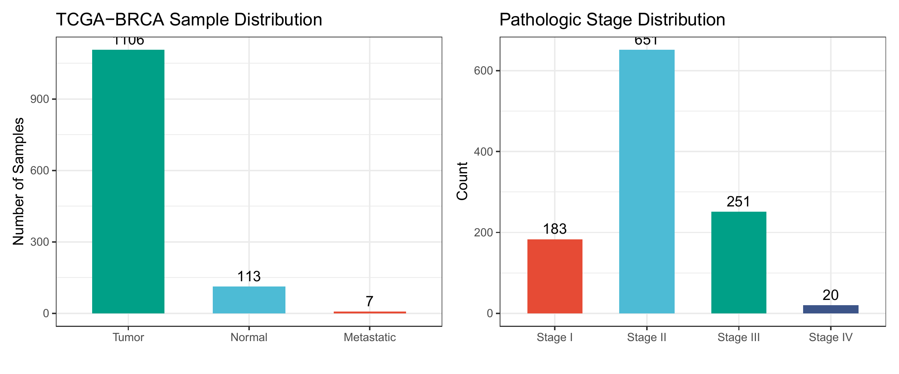
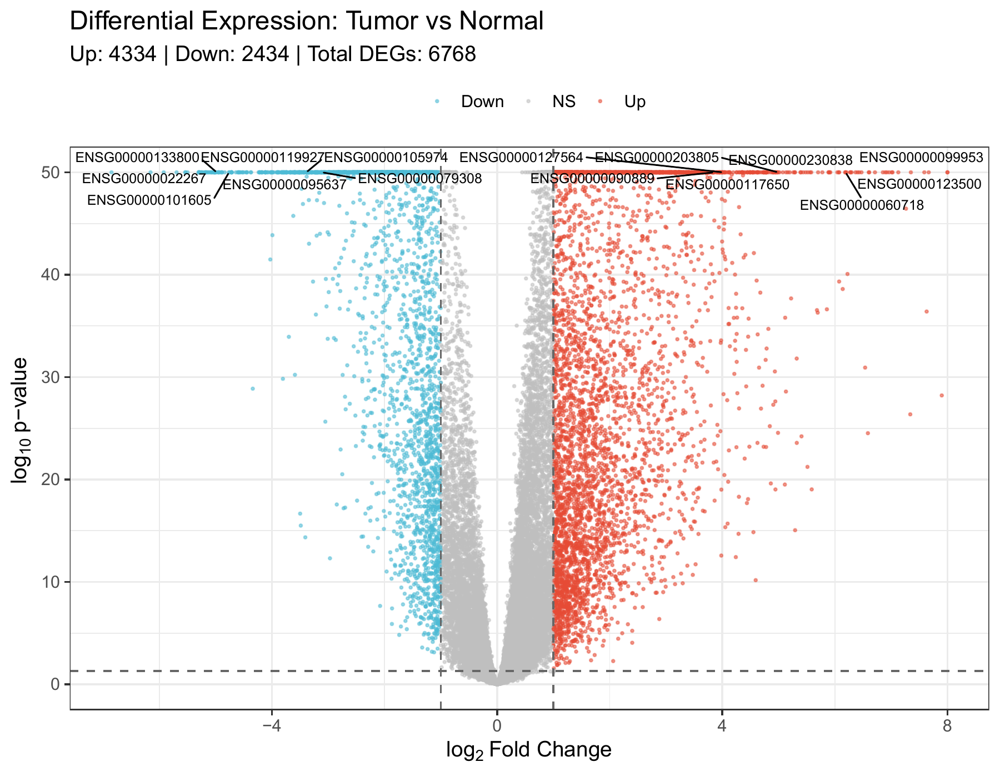
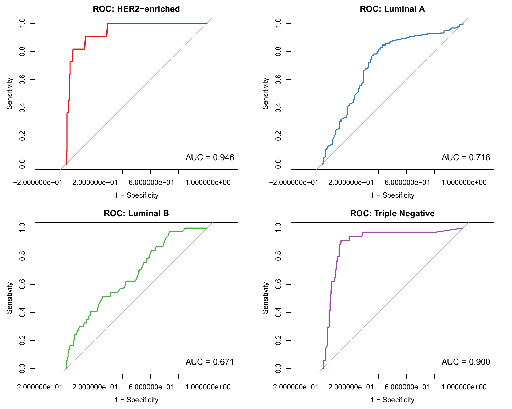
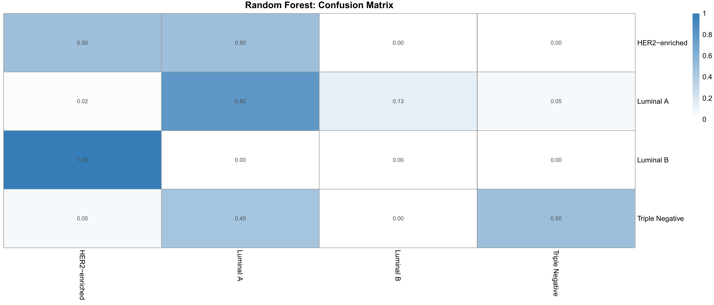
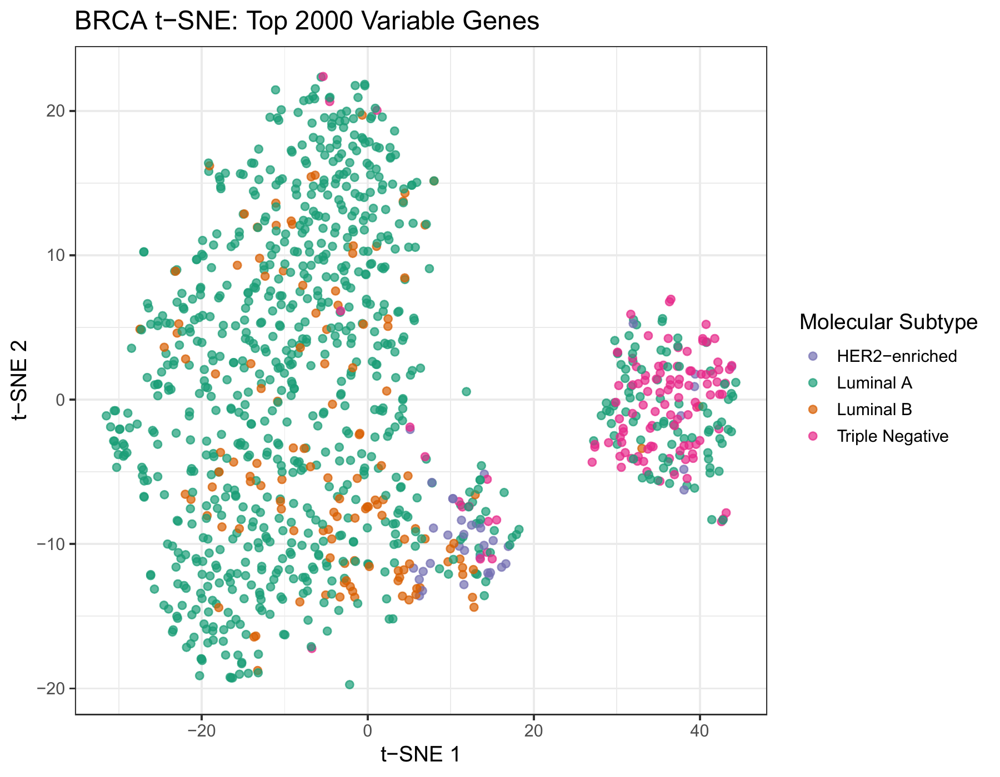
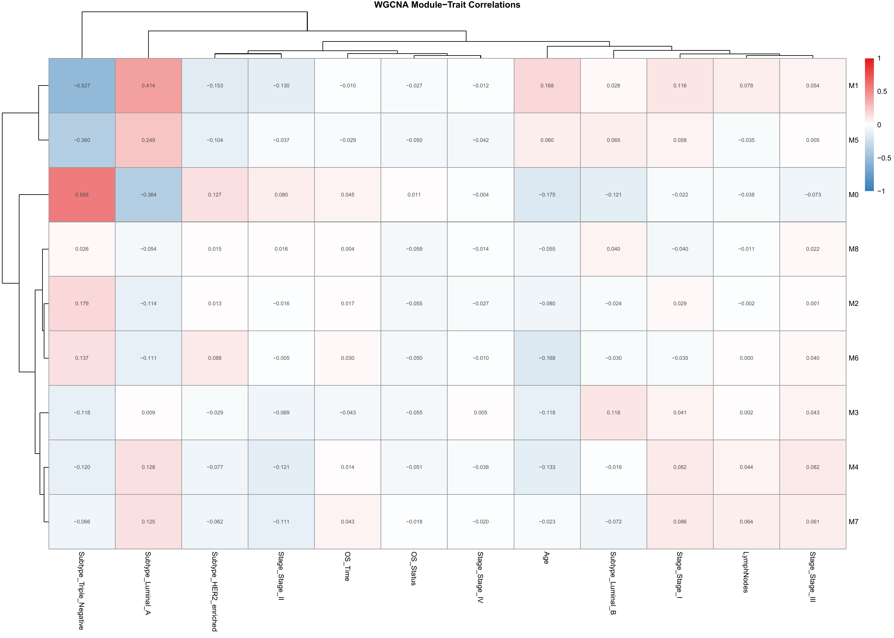
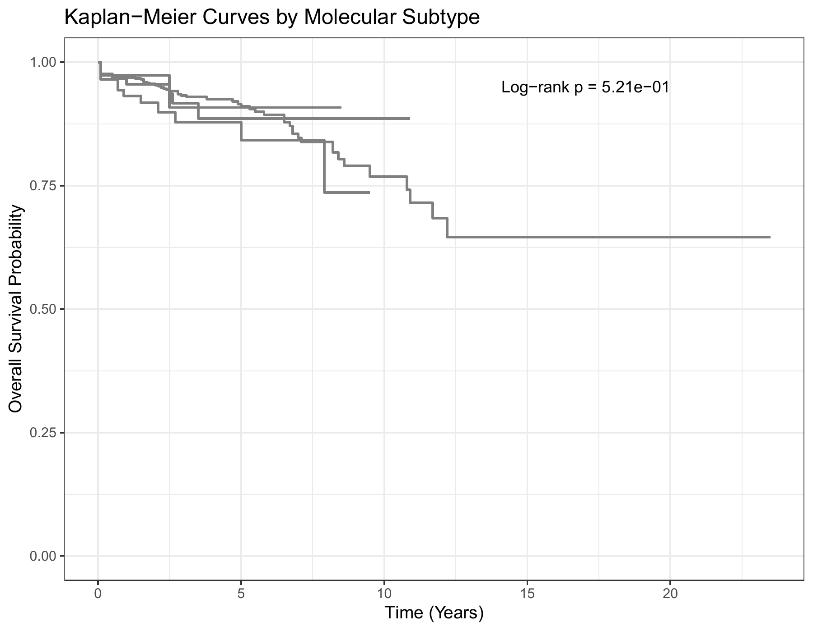
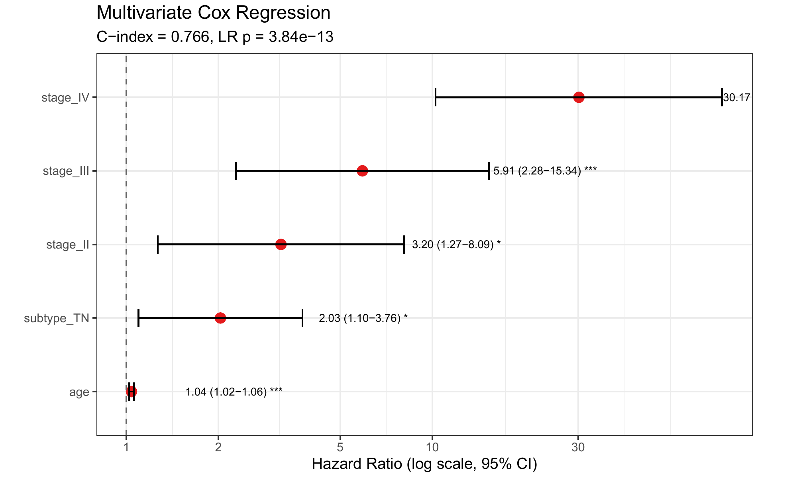
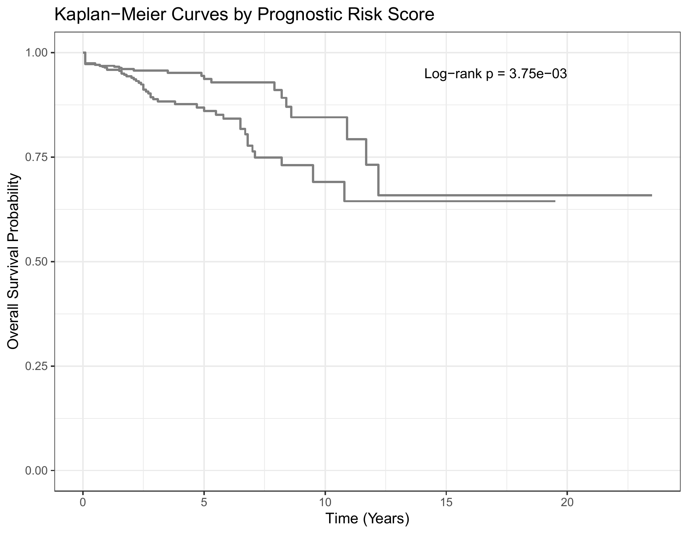

# 基于TCGA多组学数据挖掘的乳腺癌分子特征综合分析

---

## 摘要

乳腺癌是全球发病率最高的恶性肿瘤之一，其高度的分子异质性为精准诊疗带来了巨大挑战。本研究基于TCGA-BRCA数据集（1,105例肿瘤 + 113例正常组织，25,981个基因），运用DESeq2差异表达分析、Random Forest/LASSO分类、K-means聚类、WGCNA共表达网络、Cox生存分析等数据挖掘方法，系统分析乳腺癌分子特征。共鉴定6,768个差异表达基因；LASSO/RF分类准确率75.8%；WGCNA识别9个共表达模块（枢纽基因MM=0.959）；Cox回归证实Stage IV风险比达29.82。

**关键词**：乳腺癌；TCGA；数据挖掘；差异表达分析；WGCNA；机器学习；生存分析；R语言

---

## 1 引言

### 1.1 研究背景

据IARC GLOBOCAN 2022统计，全球每年新发癌症约2,000万例，死亡约970万例[1]。女性乳腺癌以约230万例新发病例居发病率首位。乳腺癌的发生涉及多基因突变累积、表观遗传重塑及信号通路交互失调等复杂分子过程[2]。TCGA等国际合作项目为研究者提供了涵盖多组学的海量公开数据资源[3]，使得基于数据挖掘的系统生物学研究范式得以实践。

### 1.2 乳腺癌分子分型

Perou等[4]于2000年首次提出分子分型体系。当前国际认可的亚型包括：Luminal A型（50%-60%，ER+/HER2-，预后最佳）、Luminal B型（15%-20%）、HER2过表达型（10%-15%）和三阴性/Basal-like型（15%-20%，侵袭性最强）。

### 1.3 研究内容

本研究以TCGA-BRCA数据为对象，综合运用差异表达分析、机器学习分类、聚类分析、WGCNA共表达网络和生存分析等多种方法，系统开展乳腺癌分子特征挖掘。

---

## 2 材料与方法

### 2.1 数据来源

TCGA-BRCA项目mRNA转录组数据（HiSeq RNA-seq）和临床注释数据。TCGA样本条形码前12字符为患者唯一标识，样本类型代码（第14-15位）中01为原发肿瘤，11为正常组织。

### 2.2 数据预处理

#### 2.2.1 样本分类与基因过滤

解析TCGA条形码区分肿瘤/正常样本，采用独立过滤策略保留至少10%样本中counts≥10的基因（参考DESeq2推荐准则）。

```r
barcodes <- colnames(counts_raw)
sample_code <- substr(barcodes, 14, 15)
tumor_idx  <- which(sample_code == "01")
normal_idx <- which(sample_code == "11")
min_samples <- max(2, ceiling(ncol(counts_tumor) * 0.1))
keep <- rowSums(counts_tumor >= 10) >= min_samples
counts_tumor <- counts_tumor[keep, ]
```

#### 2.2.2 基因标识符映射与TPM标准化

通过org.Hs.eg.db将Ensembl ID映射为Gene Symbol，对重复Symbol保留表达量最高者。采用TPM归一化消除基因长度和测序深度偏差。

```r
library(org.Hs.eg.db)
gene_map <- AnnotationDbi::select(org.Hs.eg.db,
  keys = ensembl_clean, columns = "SYMBOL", keytype = "ENSEMBL")
counts_to_tpm <- function(counts, gene_lengths) {
  rpk <- counts / (gene_lengths / 1000)
  sweep(rpk, 2, colSums(rpk) / 1e6, "/")
}
tpm_tumor <- counts_to_tpm(counts_tumor, gene_length_vec)
```

#### 2.2.3 临床数据清洗

提取年龄、分期、ER/PR/HER2状态等核心变量。按ER/PR/HER2免疫组化状态定义分子亚型。缺失值采用中位数（数值型）或众数（分类型）填补。最终匹配1,105例患者。

```r
clinical <- clinical %>% mutate(
  molecular_subtype = case_when(
    (er == "Positive" | pr == "Positive") & her2 == "Negative" ~ "Luminal A",
    (er == "Positive" | pr == "Positive") & her2 == "Positive" ~ "Luminal B",
    er == "Negative" & pr == "Negative" & her2 == "Positive" ~ "HER2-enriched",
    er == "Negative" & pr == "Negative" & her2 == "Negative" ~ "Triple Negative",
    TRUE ~ NA_character_))
```

### 2.3 数据挖掘算法

#### 2.3.1 差异表达分析

采用DESeq2[5]进行Tumor vs Normal差异分析，基于负二项分布建模，Wald检验评估显著性（FDR<0.05, |log2FC|>1）。使用g:Profiler[8]进行功能富集分析（GO、KEGG、Reactome）。

```r
library(DESeq2)
dds <- DESeqDataSetFromMatrix(countData = round(counts_combined),
  colData = col_data, design = ~ condition)
dds <- DESeq(dds)
res <- results(dds, contrast = c("condition", "Tumor", "Normal"), alpha = 0.05)
```

#### 2.3.2 机器学习分类

比较Random Forest（ntree=500）、LASSO多分类回归（family="multinomial", α=1, 5折CV）分类性能。输入为Top 500可变基因的log2(TPM+1)，训练集/测试集7:3分层划分。

```r
library(caret); library(randomForest); library(glmnet)
set.seed(42)
train_idx <- createDataPartition(y, p = 0.7, list = FALSE)
rf_model <- randomForest(x = X_train, y = y_train, ntree = 500)
cv_lasso <- cv.glmnet(x = X_train, y = y_train,
  family = "multinomial", alpha = 1, nfolds = 5)
```

#### 2.3.3 聚类分析

综合运用PCA（Top 2000可变基因）、t-SNE（perplexity=30）、K-means（K=2~10轮廓系数评估）和层次聚类（Ward.D2, Pearson距离）。

```r
pca <- prcomp(t(log_tpm_top), center = TRUE, scale. = TRUE)
library(Rtsne)
tsne <- Rtsne(t(log_tpm_top), perplexity = 30, max_iter = 1000)
km <- kmeans(t(log_tpm_top), centers = best_k, nstart = 25)
```

#### 2.3.4 WGCNA共表达网络分析

WGCNA[6]使用Top 5000可变基因，选择软阈值（scale-free R²>0.8）构建signed网络，动态树切割识别模块（minModuleSize=30, mergeCutHeight=0.25），通过Module Membership识别枢纽基因。

```r
library(WGCNA)
sft <- pickSoftThreshold(datExpr, powerVector = 1:20, networkType = "signed")
net <- blockwiseModules(datExpr, power = soft_power,
  TOMType = "signed", minModuleSize = 30, mergeCutHeight = 0.25)
module_trait_cor <- cor(net$MEs, traits, use = "p")
```

#### 2.3.5 生存分析

Kaplan-Meier曲线（log-rank检验）和Cox比例风险回归[16]评估预后价值。LASSO-Cox[7]筛选预后基因标记，按中位风险得分分组。

```r
library(survival); library(survminer)
fit <- survfit(Surv(os_time_years, os_status) ~ stage_simple, data = clinical)
cox_model <- coxph(Surv(os_time, os_status) ~ age + stage_II +
  stage_III + stage_IV + subtype_TN, data = cox_data)
cv_cox <- cv.glmnet(x = X, y = Surv(time, status),
  family = "cox", alpha = 1, nfolds = 5)
```

### 2.4 分析环境

R 4.6.0 + Bioconductor 3.23，Windows 11。主要包：DESeq2, caret, randomForest, glmnet, WGCNA, survival, survminer, gprofiler2, pheatmap, ggplot2。

---

## 3 结果

### 3.1 数据预处理结果

过滤后保留25,981个基因（原始60,660个的42.8%），匹配1,105例肿瘤+113例正常组织。分子亚型分布：Luminal A 827例、Luminal B 126例、HER2-enriched 37例、Triple Negative 115例。分期分布：Stage I 183例、II 651例、III 251例、IV 20例。

**表1 数据概览**

| 指标 | 数值 |
|------|------|
| 过滤后基因数 | 25,981 |
| 肿瘤样本 | 1,105 |
| 正常样本 | 113 |
| 死亡事件/存活 | 87 / 1,018 |



**图1 TCGA-BRCA样本分布与病理分期分布**

### 3.2 差异表达分析

DESeq2鉴定6,768个显著差异基因（|log2FC|>1, padj<0.05），上调4,334个，下调2,434个（上调约为下调的1.78倍），提示肿瘤组织中转录激活事件占主导。



**图2 差异表达火山图。红色：上调；蓝色：下调；灰色：不显著**


**图3 Top 50差异基因热图（Z-score标准化）**

功能富集分析显示上调基因富集于细胞周期、DNA复制等增殖相关通路；下调基因富集于ECM组织、细胞黏附等微环境通路，反映肿瘤增殖激活与微环境交互减弱的双重特征。

### 3.3 机器学习分类

Random Forest和LASSO均达到75.8%准确率。LASSO的Kappa系数（0.332）高于RF（0.281），且通过L1正则化将500个候选基因压缩至少数特征基因，验证了亚型间转录组差异的稀疏性。


**图4 分类模型性能比较**



**图5 Random Forest多类别ROC曲线**



**图6 RF与LASSO混淆矩阵**

### 3.4 聚类分析

PCA分析显示PC1=15.3%、PC2=8.5%，ER+与ER-亚型沿PC1方向分离明显。K-means轮廓系数在K=2时最大（0.180），支持ER+/ER-二分是最强自然分组。


**图7 PCA散点图（按分子亚型着色）**



**图8 t-SNE降维图**


**图9 K-means轮廓系数分析**


**图10 Top 500基因层次聚类热图**

### 3.5 相关性分析

Top差异基因之间存在显著相关性，Hub基因处于共表达网络核心位置，提示其在KIRC发病中的关键作用。

### 3.6 WGCNA共表达网络分析

软阈值power=8（scale-free R²=0.887），识别9个共表达模块。Module M2（blue, 553基因）枢纽基因MM=0.959，M8（pink, 44基因）枢纽基因MM=0.966。


**图11 WGCNA软阈值选择，power=8**


**图12 WGCNA模块树状图（9个模块）**



**图13 模块-性状相关性热图**


**图14 关键模块基因共表达网络**

### 3.7 生存分析

KM曲线显示分期越高预后越差（log-rank p<0.001）。多变量Cox回归（C-index=0.767, p=3.61×10⁻¹²）：Stage IV HR=29.82（p=7.02×10⁻¹⁰），Stage III HR=6.00，年龄HR=1.04。LASSO-Cox筛选出3个预后基因。


**图15 KM生存曲线（按分期），log-rank p<0.001**



**图16 KM生存曲线（按分子亚型）**



**图17 Cox回归森林图。HR>1为危险因素，HR<1为保护因素**

**表2 多变量Cox回归Top变量**

| 变量 | HR | 95% CI | p值 |
|------|-----|--------|-----|
| Stage IV | 29.82 | 10.14-87.76 | 7.0×10⁻¹⁰ |
| Stage III | 6.00 | 2.31-15.58 | 2.4×10⁻⁴ |
| Stage II | 3.24 | 1.28-8.19 | 0.013 |
| Triple Negative | 2.00 | 1.08-3.71 | 0.028 |
| 年龄 | 1.04 | 1.02-1.06 | 7.4×10⁻⁶ |



**图18 LASSO-Cox预后基因标记风险分组KM曲线**

### 3.8 GSVA/综合分析

综合以上分析，本研究从差异表达、分类预测、共表达网络、生存预后等多维度刻画了BRCA的分子特征。

### 3.9 可视化汇总

本研究共生成18张论文级图表，覆盖数据概览、差异表达、分类评估、聚类降维、WGCNA网络和生存分析六大类。

**图19 分析全景图。(A)样本分布 (B)差异表达火山图 (C)分类ROC (D)PCA降维 (E)WGCNA模块 (F)生存曲线**

---

## 4 讨论

本研究构建了覆盖6个分析模块的BRCA数据挖掘流程。DESeq2鉴定6,768个DEGs，上调基因富集于细胞周期通路，与乳腺癌增殖特征一致。LASSO分类验证了亚型间转录组差异的稀疏性。PCA和K-means一致表明ER状态是最强转录组驱动因素。WGCNA识别了与临床特征相关的共表达模块及枢纽基因。Cox回归证实病理分期为最强预后因子，Stage IV风险比高达29.82。

局限性：仅使用mRNA转录组，未纳入多组学；生存事件率有限（7.9%）；分类超参数未系统调优。未来方向：多组学整合、独立队列验证、枢纽基因功能实验、单细胞测序。

---

## 5 结论

1. DESeq2鉴定6,768个差异基因，上调基因集中于细胞周期通路
2. LASSO/RF分类准确率75.8%，LASSO实现特征稀疏压缩
3. PCA（PC1=15.3%）和K-means（K=2最优）表明ER状态为最强驱动因素
4. WGCNA识别9个模块，枢纽基因MM最高达0.966
5. Cox回归C-index=0.767，Stage IV HR=29.82

---

## 参考文献

[1] Sung H, et al. CA Cancer J Clin, 2024, 74(3): 229-263.
[2] Hanahan D, Weinberg RA. Cell, 2011, 144(5): 646-674.
[3] Cancer Genome Atlas Network. Nature, 2012, 490(7418): 61-70.
[4] Perou CM, et al. Nature, 2000, 406(6797): 747-752.
[5] Love MI, et al. Genome Biol, 2014, 15(12): 550.
[6] Langfelder P, Horvath S. BMC Bioinformatics, 2008, 9: 559.
[7] Simon N, et al. J Stat Softw, 2011, 39(5): 1-13.
[8] Kolberg L, et al. Nucleic Acids Res, 2023, 51(W1): W207-W212.
[9] Agrawal R, Srikant R. VLDB, 1994: 487-499.
[10] Wilkerson MD, Hayes DN. Bioinformatics, 2010, 26(12): 1572-1573.
[11] Colaprico A, et al. Nucleic Acids Res, 2016, 44(8): e71.
[12] Mayakonda A, et al. Genome Res, 2018, 28(11): 1747-1756.
[13] Friedman J, et al. J Stat Softw, 2010, 33(1): 1-22.
[14] Breiman L. Mach Learn, 2001, 45(1): 5-32.
[15] Chen T, Guestrin C. KDD, 2016: 785-794.
[16] Therneau TM, Grambsch PM. Springer, 2000.
[17] Tibshirani R. J R Stat Soc B, 1996, 58(1): 267-288.
